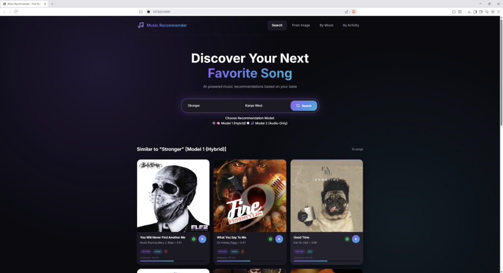
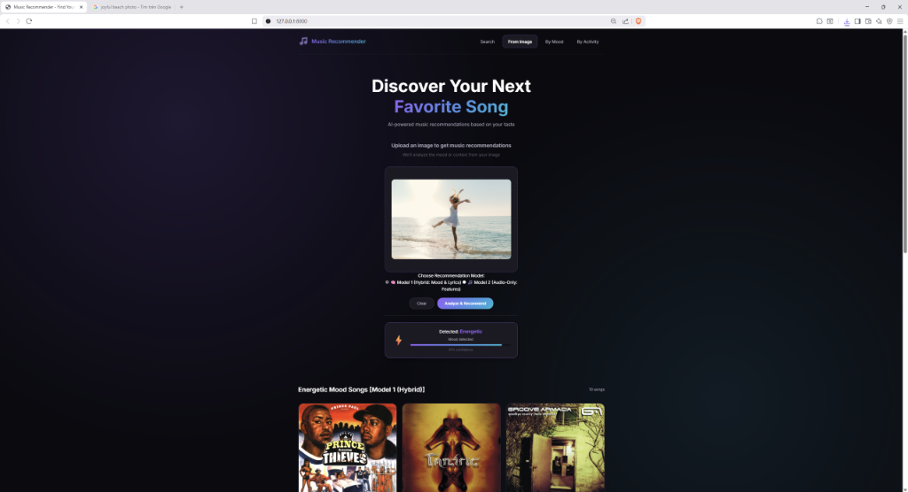
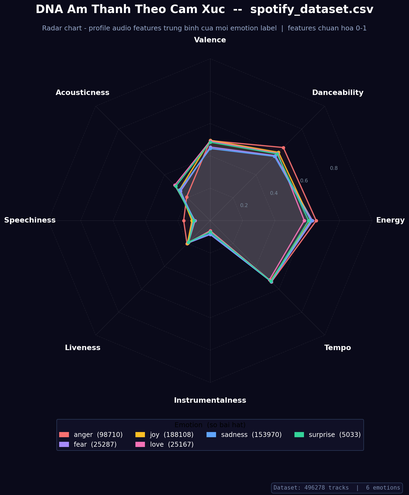
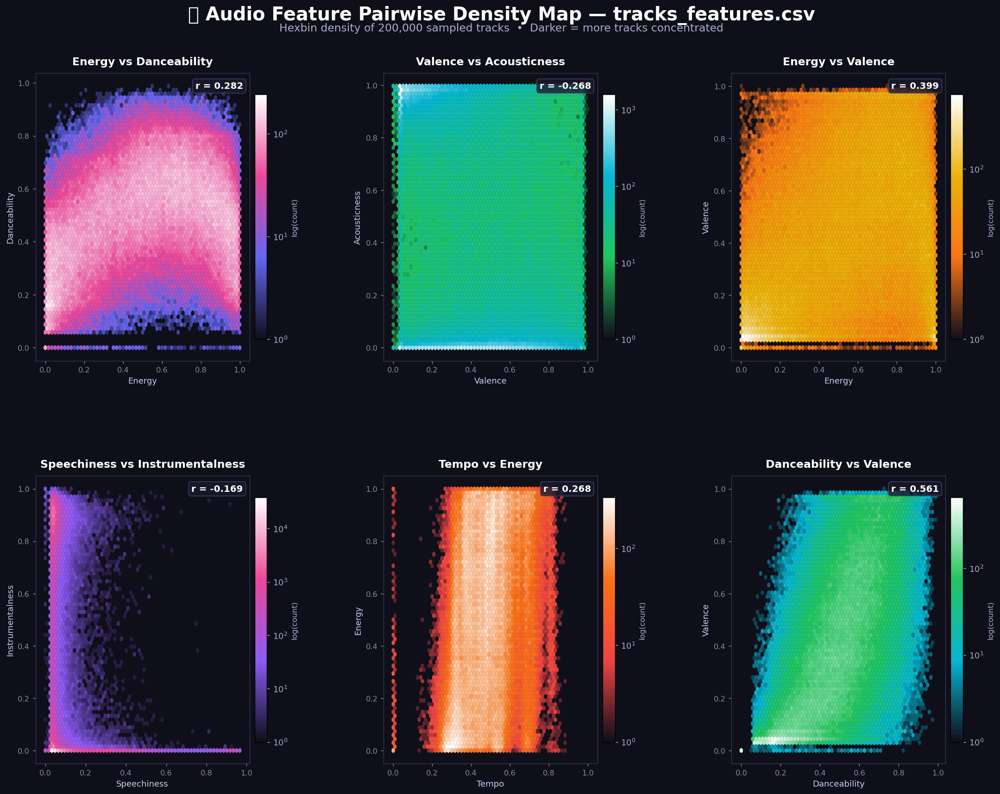

<div align="center">
  <h1>🎶 Hybrid Music Recommendation Engine</h1>
  <p>A cutting-edge, dual-model AI system that recommends music based on lyrics, audio features, visual moods, and context.</p>
</div>

<p align="center">
  
  <br><em>Giao diện tìm kiếm trực quan trả về các bài hát tương đồng kèm độ tin cậy</em>
</p>

## 📌 Project Overview
Finding the perfect song isn't just about matching genres—it's about matching **emotions, situations, and the acoustic DNA** of the listener's preferences. 

This project is a high-performance web application powered by **Machine Learning** that goes beyond conventional collaborative filtering. By analyzing 1.7 million tracks, it understands the nuanced relationship between a song's lyrics, its acoustic profile (tempo, danceability, energy), and the listener's state of mind.

## ✨ Key Features & Functionality

- **Smart Search & Autocomplete:** Start typing a song name to get instant suggestions powered by intelligent dataset matching.
- **Vibe & Context Matching:** Want a playlist for studying? For a workout? Or just feeling sad? The system maps your mood/activity instantly to the right vectors.
- **Image-to-Music (Multimodal):** Upload an image (e.g., a rainy window or a party crowd), and our CLIP-based vision model will map the visual context to acoustic features to suggest the perfect soundtrack.
  
  <p align="center">
    
    <br><em>Upload một tấm ảnh bãi biển, AI tự động nhận diện mood "Energetic" với độ tự tin 91% và gợi ý ngay list nhạc phù hợp!</em>
  </p>

- **Dual AI Engine Architecture:** Switch seamlessly between two different recommendation paradigms on the fly (Hybrid vs. Audio-Only).
- **In-App Playback:** Integrated YouTube playback directly connects you to recommended songs without leaving the app.

## 🧠 The AI Architecture: Dual Models

This engine runs not one, but two distinct models to cater to different data realities:

### Model 1: Hybrid Content-Based (Supervised)
- Over **490,000 tracked songs** with curated emotional labels (Joy, Sadness, Anger, Love, etc.).
- Fuses **Natural Language Processing (NLP)** on lyrics with normalized acoustic features.
- Recommended when you need songs that capture a specific semantic meaning and emotion.

### Model 2: Audio Autoencoder (Unsupervised)
- A massive dataset covering **1.2 million global tracks** across 7 decades.
- Bypasses human labels completely. Uses an **Audio Autoencoder** to map songs purely by their raw acoustic signature in a 256-dimensional latent space.
- Highly optimized with **FAISS** (Facebook AI Similarity Search) to ensure microsecond-level query times across millions of records.

## 📊 Data Visualizations & Insights

Our models are backed by rigorous data science. We employ advanced visualizations to understand feature distribution in the millions of songs:

<p align="center">
  
  
</p>
<p align="center">
  <em>(Left: The acoustic DNA of emotions. Right: Hexbin density map handling 1.2M songs to uncover acoustic trends)</em>
</p>

## 🛠 Tech Stack

- **Backend:** FastAPI (Python), Uvicorn
- **Machine Learning:** PyTorch, FAISS, Sentence-Transformers (BERT), OpenAI CLIP
- **Data Pipelines:** Pandas, Scikit-Learn, Seaborn, Matplotlib
- **Frontend:** Vanilla JS, HTML5, CSS3 with modern UI/UX
- **Integrations:** Spotify Web API (Metadata/Album Art), YouTube player

## 🚀 Quick Start (Local Development)

```bash
# 1. Clone the repository and navigate inside
cd music_recommender

# 2. Install dependencies
pip install -r requirements.txt

# 3. Start the FastAPI backend
cd web_app
python -m uvicorn app:app --port 8000 --reload
```
Then visit `http://localhost:8000` in your web browser.
